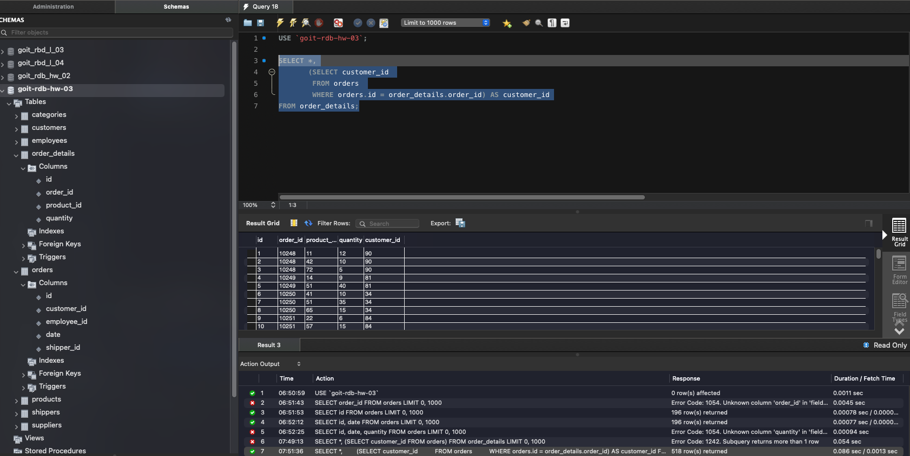
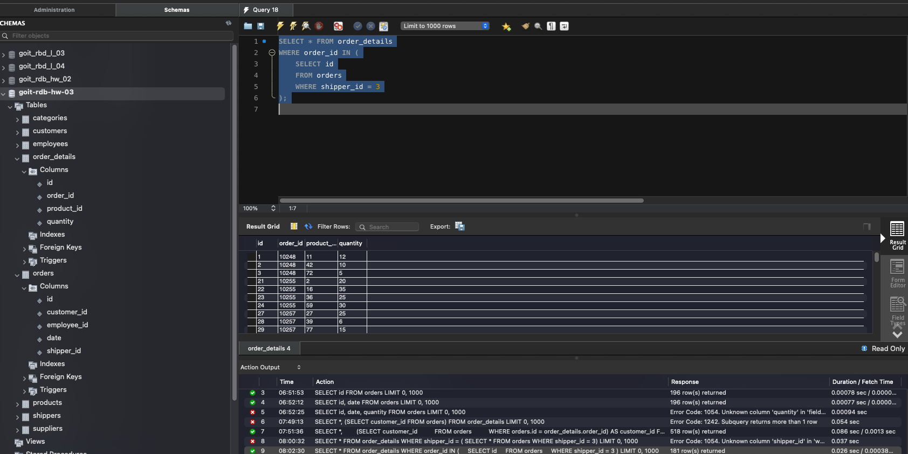
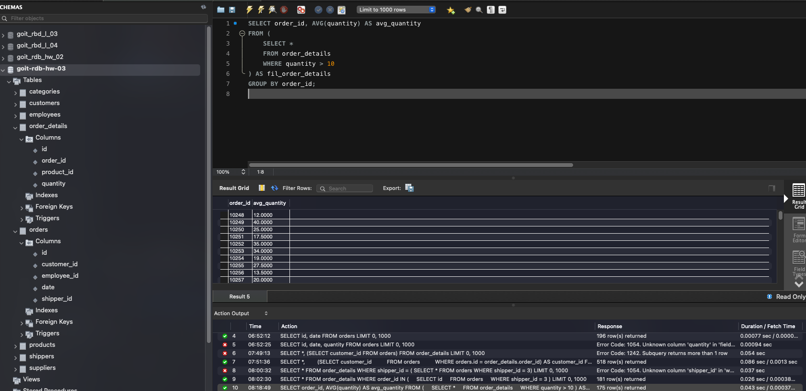
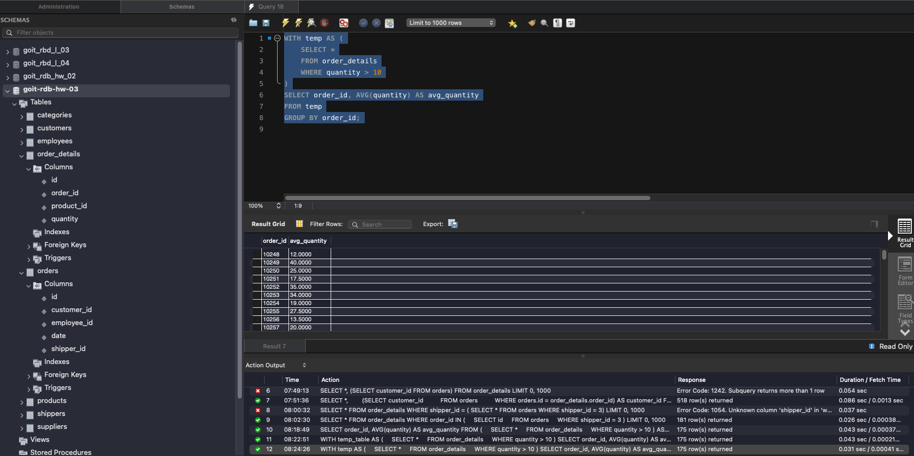
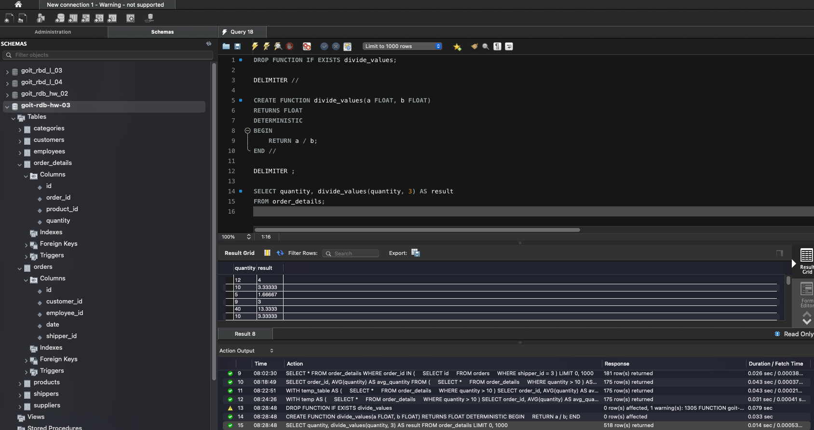

# 1. Напишіть SQL запит, який буде відображати таблицю order_details та поле customer_id з таблиці orders відповідно для кожного поля запису з таблиці order_details.;

# 2. Напишіть SQL запит, який буде відображати таблицю order_details. Відфільтруйте результати так, щоб відповідний запис із таблиці orders виконував умову shipper_id=3.;

# 3. Напишіть SQL запит, вкладений в операторі FROM, який буде обирати рядки з умовою quantity>10 з таблиці order_details.;

# 4. Розв’яжіть завдання 3, використовуючи оператор WITH для створення тимчасової таблиці temp.;

# 5. Створіть функцію з двома параметрами, яка буде ділити перший параметр на другий.;
